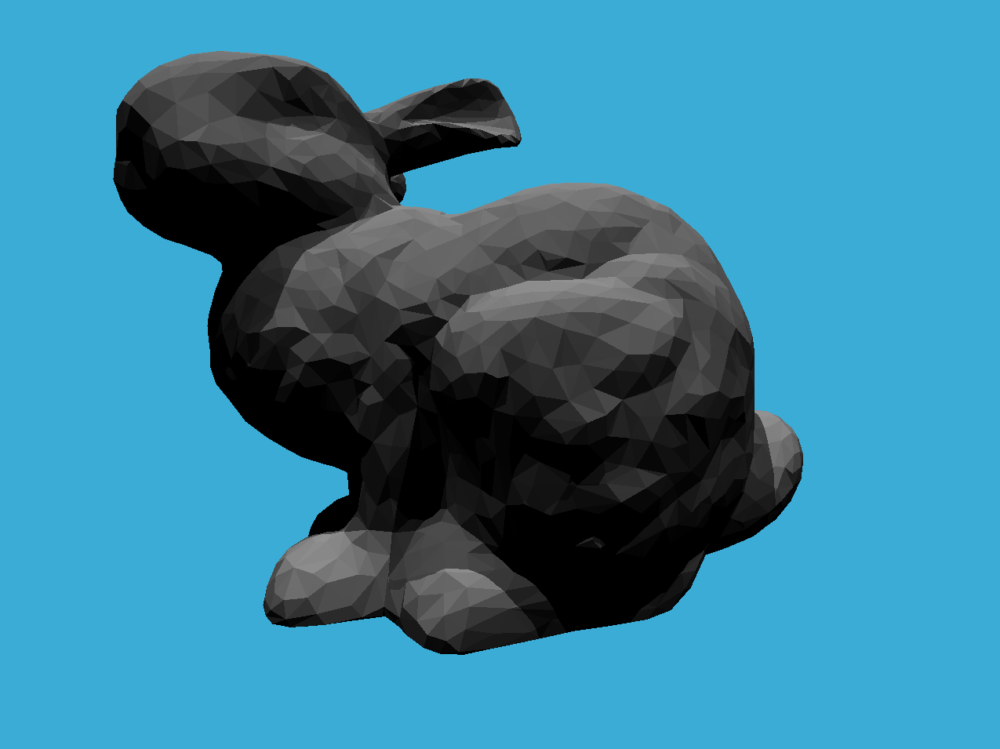

# SAH 方法

代码框架中, BVH 二叉树 使用的方法是 将所有三角形按重心坐标在 包围盒最长的方向上排序, 取中位数二分. 在 `BVH.hpp` 中被标识为 `NAIVE`.

这种方案简单, 但是有个显而易见的缺点是当实际模型中__三角形分布不均匀时__效果一般.

SAH (Surface Area Heuristic) 方法是一种能缓解上述情况的__启发式__算法. 

假设当前所有物体 (object) 集合 $P$ 的包围盒 表面积为 $S_P$. 在构建 BVH 树时要将 `objects` 分成两个子类, 此时不妨设分划后的集合为 $\{ A, B\}$, 这种分划方法记为 $D$.

为分划 $D$ 定义一种"代价/损失函数" $C$, 如下 :
$$
C(D) = C_{trav} + p(A \mid P)(n_a \cdot C_{isect}) + p(B\mid P) (n_b \cdot C_{isect})
$$
各变量意义如下

- $C_{trav}$ : 是__遍历到当前情况 $P$ 的代价__, 常数;
  - 进一步推广, BVH 的层数越深的结点, 这一项的结点越大, 这使得它可以用来进行算法终止判定. (即继续分划下去, $C_{trav}$ 的代价会占主导).
- $p(A \mid P)$ 是当 光线 $\vec r(t)$ 与 $P$ 包围盒相交时, 同时也会与 $A$ 包围盒相交的概率. 
- $p(B\mid P)$ 同上.
- $n_a, n_b$ 是 分到 $A, B$ 类中的三角形. 
  - 要求 $n_a, n_b > 0$, 否则算法实现时递归无法终止.
  - 若无法找到分划, 可以直接将当前结点视为__叶子结点__, 将 $P$ 中的 objects 全部记录到当前结点下.
- $C_{isect}$ 是光线与三角形求交的代价/损失, 是常数.

这个定义是合理的, 如果某种分划使得进入 $P$ 的光线更容易打到 $A$, 即 $p(A\mid P)$ 更高, 出于性能考虑, 计算代价低是合理的, 所以此时应尽量使 $A$ 中的物体更少 (与其中的物体求交的次数更少, 总代价也更少) .

 $p(A \mid P) (n_a \cdot C_{isect})$ 中, 两项因子是此消彼长的, 而 SAH 方法就是找到 代价最小的一种划分方法 $D = \{ A,B\}$. 

几何概率学中有结论 :
$$
p(A\mid P) = \frac{S_A}{S_P}
$$
其中 $S_A, S_P$ 是对应包围盒的表面积, 于是公式自然改写为
$$
C(D) = C_{trav} + \frac{S_A}{S_P}(n_a \cdot C_{isect}) + \frac{S_B}{S_P} (n_b \cdot C_{isect})
$$
还有一个问题是, 在实际应用的时候, 如何限制分划的搜索范围呢? 仍然可以保留 Median 分划法中, 分划 $x,y,z$ 轴中包围盒的最长的方向. 假设是分划 $x$ 轴, 即用 $x = t$ 来切割原来的包围盒, $t$ 通过最小化 $C(D)$ 得到.

求解 $C(D)$ 最小化的时候, 等间距网格搜索是很慢的方法, 且根据问题背景的特点, 也没有必要. 因为分划的结果是离散的, 只会在某些特定的 $t$ 值处产生不同的 $C(D)$ . 容易想到的是 每个三角形的重心(或者其他图元的包围盒中心) 就是一个临界点, 当$t$ 的变化经过了某个图元的中心的 $x$ 坐标 (或 $y, z$) 才会影响 $C(D)$ 值的. 

但是直接使用上述方法仍然会面临不少的计算量 : 假设模型有 几百万个图元, 仅仅是一个BVH结点的构造就需要几百万次的代价计算, 这仍然不可接受. 

于是, 在计算量与SAH方法间权衡, 一个能大幅缩减计算量的近似方法是 __分桶__ (Binning) : 将待分割区域分划为 $n$ 块 (通常是等距离), 每一块称为__桶__, 仅考虑以这些桶的边界值 $t_i, i =1,2,\cdots,n$ 作为搜索的范围. 于是, 每一个结点的计算量都被限制在 $n$ 次, 且 $n$ 可自行调节.  

# Median BVH

运行结果如下

```
Time Taken: 0 hrs, 0 mins, 0 secs

 - Generating BVH...

BVH Generation complete:
Time Taken: 0 hrs, 0 mins, 0 secs

Render complete: ======================================================] 100 %
Time taken: 0 hours
          : 0 minutes
          : 7 seconds
```


# SAH-BVH

运行结果如下

```
BVH Generation complete:
Time Taken: 0 hrs, 0 mins, 0 secs

 - Generating BVH...

BVH Generation complete:
Time Taken: 0 hrs, 0 mins, 0 secs

Render complete: ======================================================] 100 %
Time taken: 0 hours
          : 0 minutes
          : 6 seconds
```

----

在文档提供的摄像机的图片生成中, SAH 加速相比 普通的中位数划分快了大约0~1秒.


将摄像机位置设置为 `eye_pos(-1, 5, 7)` , (离兔子更近), 此时

- `NAIVE` 方法完成渲染需要 16 秒
- `SAH` 方法完成渲染需要 13 秒

可见在光线反射次数较多时, SAH 方法的时间优势会更明显.

